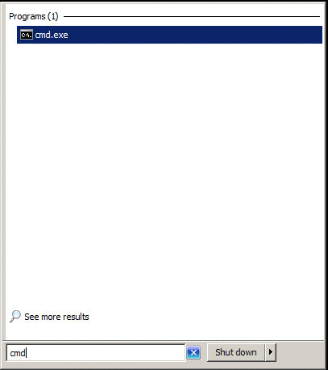
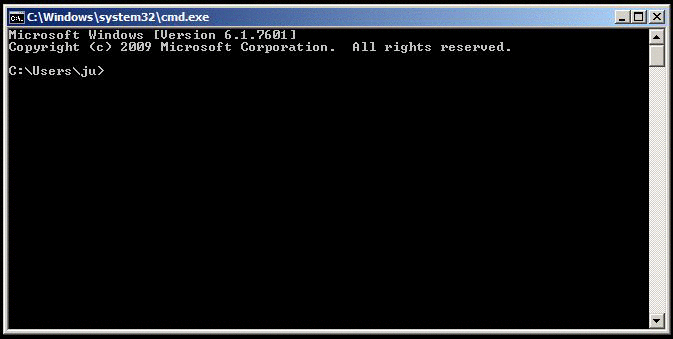
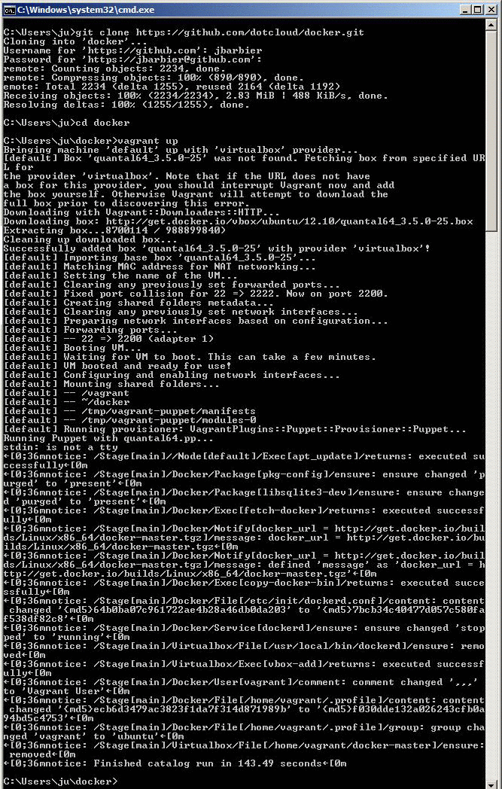
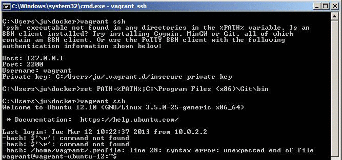
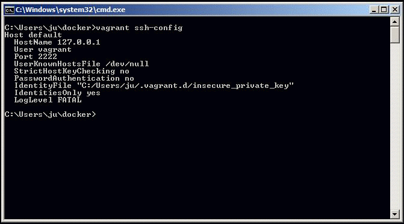
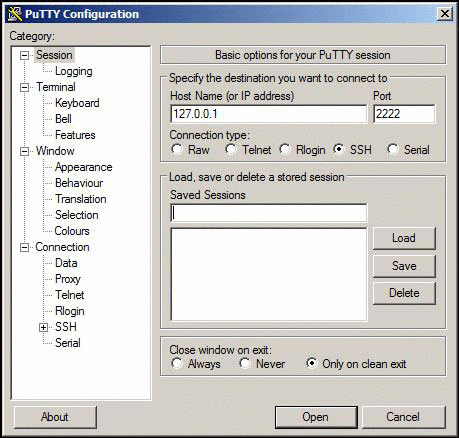
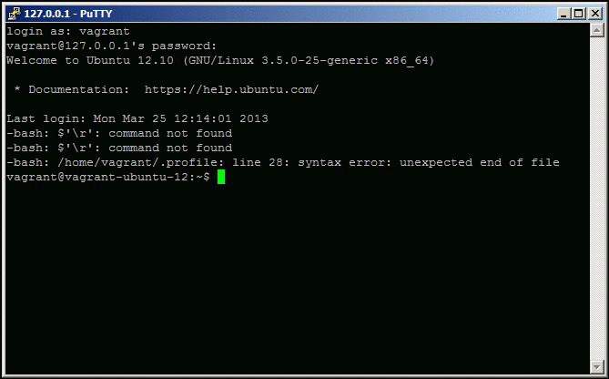
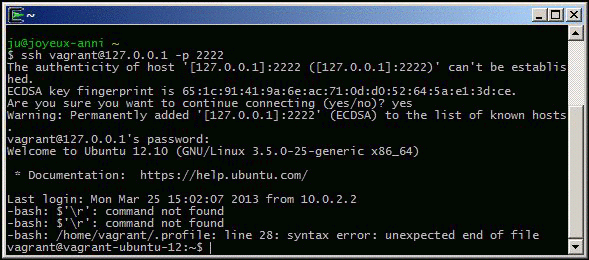
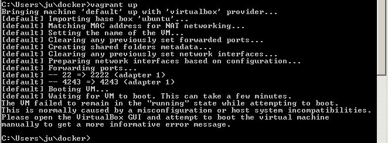
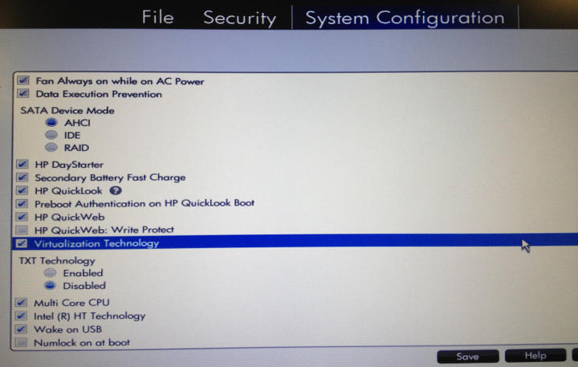

title
:   Requirements and Installation on Windows

description
:   Docker's tutorial to run docker on Windows

keywords
:   Docker, Docker documentation, Windows, requirements, virtualbox,
    vagrant, git, ssh, putty, cygwin

Using Vagrant (Windows)
=======================

Docker can run on Windows using a VM like VirtualBox. You then run Linux
within the VM.

Installation
------------

1.  Install virtualbox from <https://www.virtualbox.org> - or follow
    this
    [tutorial](http://www.slideshare.net/julienbarbier42/install-virtualbox-on-windows-7)
2.  Install vagrant from <http://www.vagrantup.com> - or follow this
    [tutorial](http://www.slideshare.net/julienbarbier42/install-vagrant-on-windows-7)
3.  Install git with ssh from <http://git-scm.com/downloads> - or follow
    this
    [tutorial](http://www.slideshare.net/julienbarbier42/install-git-with-ssh-on-windows-7)

We recommend having at least 2Gb of free disk space and 2Gb of RAM (or
more).

Opening a command prompt
------------------------

First open a cmd prompt. Press Windows key and then press “R” key. This
will open the RUN dialog box for you. Type “cmd” and press Enter. Or you
can click on Start, type “cmd” in the “Search programs and files” field,
and click on cmd.exe.

This should open a cmd prompt window.

Alternatively, you can also use a Cygwin terminal, or Git Bash (or any
other command line program you are usually using). The next steps would
be the same.

Launch an Ubuntu virtual server
-------------------------------

Let’s download and run an Ubuntu image with docker binaries already
installed.

~~~~ {.sourceCode .bash}
git clone https://github.com/dotcloud/docker.git 
cd docker
vagrant up
~~~~

Congratulations! You are running an Ubuntu server with docker installed
on it. You do not see it though, because it is running in the
background.

Log onto your Ubuntu server
---------------------------

Let’s log into your Ubuntu server now. To do so you have two choices:

-   Use Vagrant on Windows command prompt OR
-   Use SSH

### Using Vagrant on Windows Command Prompt

Run the following command

~~~~ {.sourceCode .bash}
vagrant ssh
~~~~

You may see an error message starting with “ssh executable not found”.
In this case it means that you do not have SSH in your PATH. If you do
not have SSH in your PATH you can set it up with the “set” command. For
instance, if your ssh.exe is in the folder named “C:Program Files
(x86)Gitbin”, then you can run the following command:

~~~~ {.sourceCode .bash}
set PATH=%PATH%;C:\Program Files (x86)\Git\bin
~~~~

### Using SSH

First step is to get the IP and port of your Ubuntu server. Simply run:

~~~~ {.sourceCode .bash}
vagrant ssh-config 
~~~~

You should see an output with HostName and Port information. In this
example, HostName is 127.0.0.1 and port is 2222. And the User is
“vagrant”. The password is not shown, but it is also “vagrant”.

You can now use this information for connecting via SSH to your server.
To do so you can:

-   Use putty.exe OR
-   Use SSH from a terminal

#### Use putty.exe

You can download putty.exe from this page
<http://www.chiark.greenend.org.uk/~sgtatham/putty/download.html> Launch
putty.exe and simply enter the information you got from last step.

Open, and enter user = vagrant and password = vagrant.

#### SSH from a terminal

You can also run this command on your favorite terminal (windows prompt,
cygwin, git-bash, …). Make sure to adapt the IP and port from what you
got from the vagrant ssh-config command.

~~~~ {.sourceCode .bash}
ssh vagrant@127.0.0.1 –p 2222
~~~~

Enter user = vagrant and password = vagrant.

Congratulations, you are now logged onto your Ubuntu Server, running on
top of your Windows machine !

Running Docker
--------------

First you have to be root in order to run docker. Simply run the
following command:

~~~~ {.sourceCode .bash}
sudo su
~~~~

You are now ready for the docker’s “hello world” example. Run

~~~~ {.sourceCode .bash}
docker run busybox echo hello world
~~~~

All done!

Now you can continue with the hello\_world example.

Troubleshooting
---------------

### VM does not boot

If you run into this error message "The VM failed to remain in the
'running' state while attempting to boot", please check that your
computer has virtualization technology available and activated by going
to the BIOS. Here's an example for an HP computer (System configuration
/ Device configuration)

On some machines the BIOS menu can only be accessed before startup. To
access BIOS in this scenario you should restart your computer and press
ESC/Enter when prompted to access the boot and BIOS controls. Typically
the option to allow virtualization is contained within the BIOS/Security
menu.

### Docker is not installed

If you run into this error message "The program 'docker' is currently
not installed", try deleting the docker folder and restart from
launch\_ubuntu
