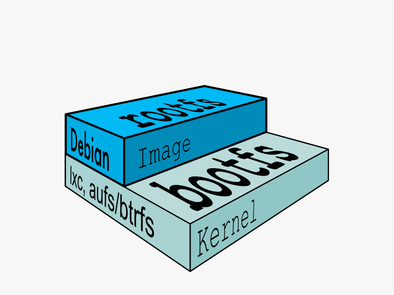

title
:   Images

description
:   Definition of an image

keywords
:   containers, lxc, concepts, explanation, image, container

Image
=====

In Docker terminology, a read-only layer\_def is called an **image**. An
image never changes.

Since Docker uses a ufs\_def, the processes think the whole file system
is mounted read-write. But all the changes go to the top-most writeable
layer, and underneath, the original file in the read-only image is
unchanged. Since images don't change, images do not have state.

Parent Image
------------

Each image may depend on one more image which forms the layer beneath
it. We sometimes say that the lower image is the **parent** of the upper
image.

Base Image
----------

An image that has no parent is a **base image**.
